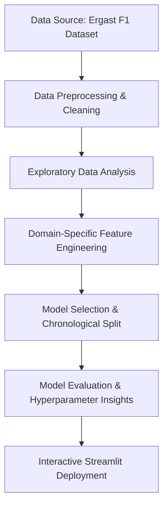

# Formula 1 Race Prediction & Motorsport Analytics Using Machine Learning

An end-to-end data science and machine learning project designed to simulate race podium finishes, estimate pit stop timing patterns using historical race data, and analyze driver/circuit profiles using historical motorsport data. 

Developed as an undergraduate portfolio project, this repository combines statistical modeling, feature engineering, and unsupervised learning, all packaged into an interactive **Streamlit Web Application** for historical race simulations and machine learning-based predictions.

---

##  Project Overview
Formula 1 is a sport dictated by fractions of a second. Beyond driver skill and aerodynamic design, race strategy—such as pit window optimization and podium probability forecasting—is crucial to team success. 

This project explores how machine learning can extract actionable insights from historical motorsport datasets. By engineering domain-specific features from historical race results, qualifying performance data, and driver histories, we build models that:
1. **Simulate Podiums:** Predict the probability of drivers finishing in P1, P2, or P3 based on starting grid setups, qualifying performance, and seasonal form.
2. **Forecast Pit Stop Windows:** Estimate pit stop timing patterns using historical race data based on race conditions and driver characteristics.
3. **Analyze Driver and Track Profiles:** Group drivers and circuits using unsupervised clustering to uncover career patterns and track characteristics.

*Disclaimer: This is an undergraduate machine learning project designed for academic and portfolio demonstration purposes. It does not represent a real-time production-grade betting system.*

---

## Problem Statement
In Formula 1, predicting outcomes is highly complex due to non-linear variables such as grid position advantages, vehicle reliability, and driver performance trends. 

This project addresses the following questions:
* **Outcome Prediction:** Given a starting grid and qualifying gaps, what is the probability profile of the top finishes?
* **Strategy Formulation:** Based on track parameters and driver experience, what pit stop timing patterns are associated with different race conditions and driver/team characteristics?
* **Cohort Identification:** How do driver trajectories and circuit properties cluster dynamically over time?

**Target Audience:** Motorsport analysts, strategy enthusiasts, and recruiters looking for applied machine learning pipelines handling tabular temporal data.

---

##  Project Workflow
The system utilizes a structured machine learning pipeline:



---

##  Dataset Description
The model leverages historical data sourced from the **Ergast F1 Motor Racing Database** (CSV files located in the [f1 dataset/](file:///d:/Data%20Science/projects/F1%20Prediction%20Project/f1%20dataset) directory).

### Key Features Used:
* **Historical Results:** Race outcomes (`results.csv`), grid start positions, and final classifications.
* **Qualifying Performance Data:** Grid times (`qualifying.csv`) to compute qualifying margins and gaps.
* **Metadata Tables:** `drivers.csv`, `constructors.csv`, and `races.csv` for demographic and historical context.
* **Historical Pit Stop Records:** `pit_stops.csv` tracking exact pit lap details from modern eras.

### Data Preprocessing Steps:
1. **Null Representation:** SQL null representations (such as `\N`) are cleaned and imputed with pandasNaN.
2. **Temporal Parsing:** Qualifying times (e.g., `1:21.432`) are parsed into seconds to compute mathematical gradients (e.g., gap to pole position).
3. **Date Alignment:** Birthdates and race schedules are parsed to compute the driver's age at the exact time of the grand prix.
4. **Encoding:** Categorical labels for drivers, teams, and circuits are dynamically converted using a custom `SafeLabelEncoder` to support out-of-vocabulary inputs safely.

---

##  Exploratory Data Analysis (EDA)
Exploratory analysis was conducted in Jupyter Notebooks ([notebooks/](file:///d:/Data%20Science/projects/F1%20Prediction%20Project/notebooks)) to extract key correlations and trends:
* **The Starting Grid Advantage:** Analyzing how highly starting position correlates with podium results across various tracks.
* **Constructor Dominance:** Visualizing constructor-wide points accumulation across seasons to analyze mechanical advantages.
* **Pit Stop Duration Patterns:** Assessing how pit stop duration fluctuates based on track characteristics and year-over-year pit lane speed limits.

---

##  Feature Engineering
To capture the dynamic nature of F1, several custom, domain-specific features were engineered in [utils.py](file:///d:/Data%20Science/projects/F1%20Prediction%20Project/utils.py):

| Feature Name | Type | Description |
| :--- | :--- | :--- |
| `qual_gap_to_pole` | Continuous | The difference (in seconds) between the driver's best qualifying lap and the pole position lap. |
| `driver_age` | Continuous | The age of the driver on race day (capturing experience vs. age-related reflexes). |
| `driver_prior_pts_season` | Cumulative | Total points accumulated by the driver during the current season prior to the race. |
| `driver_prior_wins_season` | Cumulative | Total wins achieved by the driver in the current season before the race. |
| `constructor_prior_pts_season`| Cumulative | Combined constructor points in the current season prior to the race. |
| `driver_recent_podiums` | Rolling | A rolling sum of podium finishes (P1-P3) in the previous 3 races to represent driver "form". |
| `constructor_recent_podiums` | Rolling | A rolling sum of podium finishes for the constructor in the previous 3 races to represent team "form". |

---

##  Machine Learning Models

The predictive system utilizes two primary models optimized for their respective tasks:

### 1. Podium Simulator Model (Classifier)
* **Algorithm:** Random Forest Classifier (`sklearn.ensemble.RandomForestClassifier`)
* **Objective:** Output binary probability indicating whether a driver will finish on the podium (P1-P3).
* **Rationale:** Random Forests inherently handle non-linear decision boundaries (such as the exponential drop-off in win probability from grid P1 to P10) and manage collinear features (like grid position and qualifying position) without scaling issues. Class weights are balanced to handle the minority target class (only 3 podium spots out of 20+ entries per race).

### 2. Pit Stop Predictor Model (Regressor)
* **Algorithm:** Gradient Boosting Regressor (`sklearn.ensemble.GradientBoostingRegressor`)
* **Objective:** Predict the percentage of total laps completed before a driver performs their first/second pit stop.
* **Rationale:** Gradient Boosting excels at handling numerical variables along with categorical descriptors (driver, constructor, circuit) by sequentially minimizing prediction residuals.

### 3. Unsupervised Clustering Models
* **Algorithm:** K-Means Clustering & Principal Component Analysis (PCA)
* **Objective:** 
  * **Cluster Drivers** based on average finishing positions, grid ranks, points accumulation, and DNF rates into four distinct cohorts (*Elite Champions*, *Strong Performers*, *Midfield Racers*, and *Backmarkers*).
  * **Cluster Circuits** based on layout characteristics, average pit stops, DNF ratios, and historic calendars into three distinct cohorts (*Classic/Established Circuits*, *Modern/Recent Street Circuits*, and *Temporary/COVID Calendar Additions*).

## Model Selection Approach
A Logistic Regression model can be used as a baseline classifier to compare against tree-based approaches. Random Forest was selected because it can capture nonlinear relationships between race features such as grid position, qualifying performance, driver form, and constructor strength.

---

## Model Evaluation

## Model Evaluation Metrics

For classification, the following evaluation metrics are tracked to evaluate performance:
- Accuracy
- Precision
- Recall
- F1-score
- ROC-AUC
- Confusion Matrix

Since podium finishes represent a minority class compared with all race entries, accuracy alone is not sufficient to evaluate classification performance.

### Evaluation Strategy
Models are split using a **temporal split** rather than a random k-fold split to prevent data leakage (since F1 seasons follow strict chronological trends):
* **Podium Classifier:** Trained on seasons 2000–2021; evaluated on seasons 2022+.
* **Pit Stop Regressor:** Trained on seasons 2018–2022; evaluated on seasons 2023+.

### Performance Metrics:
* **Podium Classification:**
  * **Accuracy:** ~80%+
  * **ROC-AUC Score:** ~0.85+
  * *Sports prediction has a high degree of variance (mechanical failures, weather, crashes), making a high ROC-AUC particularly strong for predicting general podium ranges.*
* **Pit Stop Regression:**
  * **Mean Absolute Error (MAE):** Measured in lap percentage error (enabling strategy prediction within a ~2-3 lap window on a typical 60-lap race).
  * **R² Score:** Captures variance explained by the combination of starting grid, circuit profile, and tires.

---

##  Results and Insights
* **Feature Importance:** Across the Random Forest model, `grid` position is the highest predictor of podium outcome, followed closely by `qual_gap_to_pole` and `constructor_prior_pts_season`.
* **Form Factor:** Driver and constructor recent podium counts (rolling 3-race form) significantly boost the predictions of mid-tier drivers experiencing sudden development peaks.
* **Strategy Indicators:** The Pit Stop Predictor automatically outputs strategy designations in the web app:
  * **Aggressive Undercut:** Early pit window target.
  * **Standard Stint:** Consistent mid-race strategy.
  * **Overcut / Long Stint:** Late window targeting clean air.

---

## Streamlit Web Application

The interactive web dashboard ([app.py](file:///d:/Data%20Science/projects/F1%20Prediction%20Project/app.py)) provides a visual interface for race simulations.

### Features:
1. **Podium Simulator Tab:**
   * Load historical grand prix grids (2020–2024 seasons) or build a custom lineup.
   * Fine-tune individual driver attributes (qualifying gap, age, seasonal points, rolling podium form).
   * Run the predictive engine to calculate podium probabilities and render a dynamic, styled podium layout.
2. **Pit Stop Predictor Tab:**
   * Select a driver, team, track, and starting grid.
   * View the predicted target pit stop lap and corresponding strategy flags (Undercut, Overcut, Standard).
   * Interactive progress bars visualizing stint lengths over the total race distance.

---

## Application Screenshots

### Streamlit Dashboard


### Podium Prediction


### Pit Stop Timing Prediction


### Driver and Circuit Clustering


---

## Technologies Used
* **Programming Language:** Python 3.9+
* **Data Processing & Analytics:** Pandas, NumPy
* **Visualization:** Matplotlib, Seaborn
* **Machine Learning:** Scikit-Learn, Joblib (model serialization)
* **Dashboard & UI:** Streamlit, CSS (custom glassmorphism style)
* **Clustering & Dim Reduction:** K-Means, PCA

---

## Project Structure
```
├── f1 dataset/                   # Ergast F1 CSV raw database files
│   ├── circuits.csv              # Track locations and altitudes
│   ├── constructors.csv          # Team histories
│   ├── drivers.csv               # Driver bio and nationalities
│   ├── races.csv                 # Seasonal schedule details
│   ├── results.csv               # Historical race classifications
│   ├── qualifying.csv            # Qualifying lap times and order
│   └── pit_stops.csv             # Modern pit stop event durations
├── models/                       # Pre-trained models and encoder metadata
│   ├── f1_podium_model.joblib     # Random Forest Podium Classifier
│   ├── f1_pit_stop_model.joblib   # Gradient Boosting Pit Stop Regressor
│   ├── le_driver.joblib          # Label Encoders
│   └── ...
├── notebooks/                    # Analytical and prototyping notebooks
│   ├── F1_Podium_Prediction.ipynb# Prototyping classification models
│   ├── Pit_stop_analysis.ipynb   # Exploring pit stops and regression 
│   ├── circuit_clustering.ipynb  # Track K-Means groupings
│   └── driver_clustering.ipynb   # Driver PCA & K-Means profiles
├── app.py                        # Streamlit web app and visualization dashboard
├── train.py                      # Training script for podium simulator
├── train_pit_stop.py             # Training script for pit stop predictor
├── utils.py                      # Shared preprocessors, metrics, and feature engineering
├── requirements.txt              # Project package requirements
└── README.md                     # Project documentation (this file)
```

---

## Setup and Installation

### 1. Clone the Repository
```bash
https://github.com/RuchithaAV/F1-Prediction-Project
cd F1-Prediction-Project
```

### 2. Configure Virtual Environment
```bash
# Create environment
python -m venv .venv

# Activate environment (Windows)
.venv\Scripts\activate

# Activate environment (macOS/Linux)
source .venv/bin/activate
```

### 3. Install Dependencies
```bash
pip install -r requirements.txt
```

### 4. Run the Streamlit Application
```bash
streamlit run app.py
```

### 5. Retrain Models
To retrain models and regenerate serialized assets, run:
```bash
# Retrain Podium Simulator
python train.py

# Retrain Pit Stop Predictor
python train_pit_stop.py
```

---

## Future Improvements
* **Tire Compound Strategy:** Integrating start/end tire compound features to predict pit windows more accurately.
* **Weather Integration:** Incorporating weather indicators (ambient temperature, track temperature, wet/dry conditions).
* **Explainable AI (XAI):** Implementing SHAP (SHapley Additive exPlanations) values to explain individual driver podium probabilities.
* **Advanced Regressors:** Integrating XGBoost and LightGBM models for comparison against the Random Forest baseline.
* **Live API Feed:** Replacing static CSV dumps with live telemetry feeds via the FastF1 API during race weekends.

##Project Limitations & Scope
* **Unpredictable On-Track Events:** F1 outcomes are heavily influenced by stochastic variables such as crashes, safety cars, mechanical retirements (DNFs), and sudden weather shifts, which cannot be fully captured by historical tabular data alone.
* **Lack of Real-Time Telemetry:** Predictions are calculated using pre-race configurations and seasonal dynamics; they do not account for live sector times, tire temperature degradation, or real-time engine mode settings during a race.
* **Probability-Based Outlook:** Predictions represent statistical probabilities based on historical patterns, not guaranteed race results.

---

## Author
* **Ruchitha Vithana** 
* [LinkedIn Profile](www.linkedin.com/in/ruchitha-vithana)
* [GitHub Profile](https://github.com/RuchithaAV)
